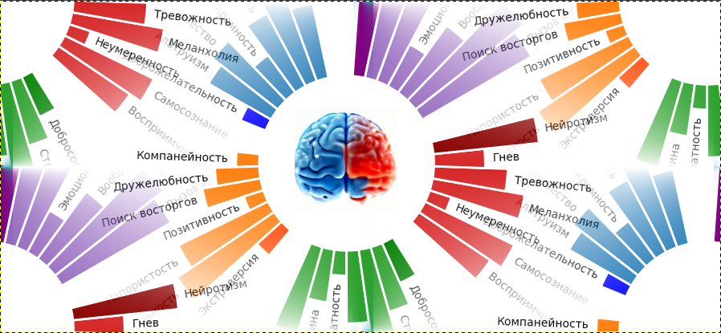
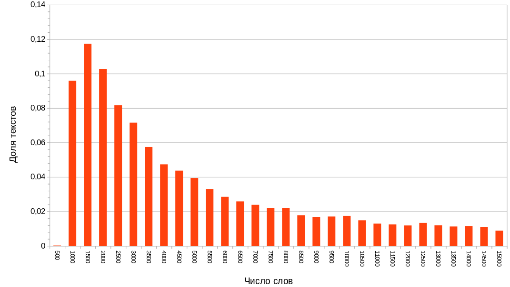
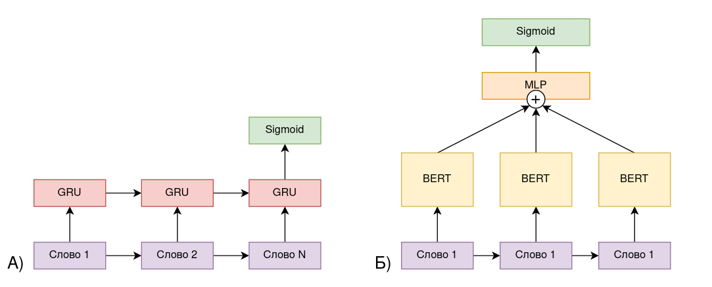
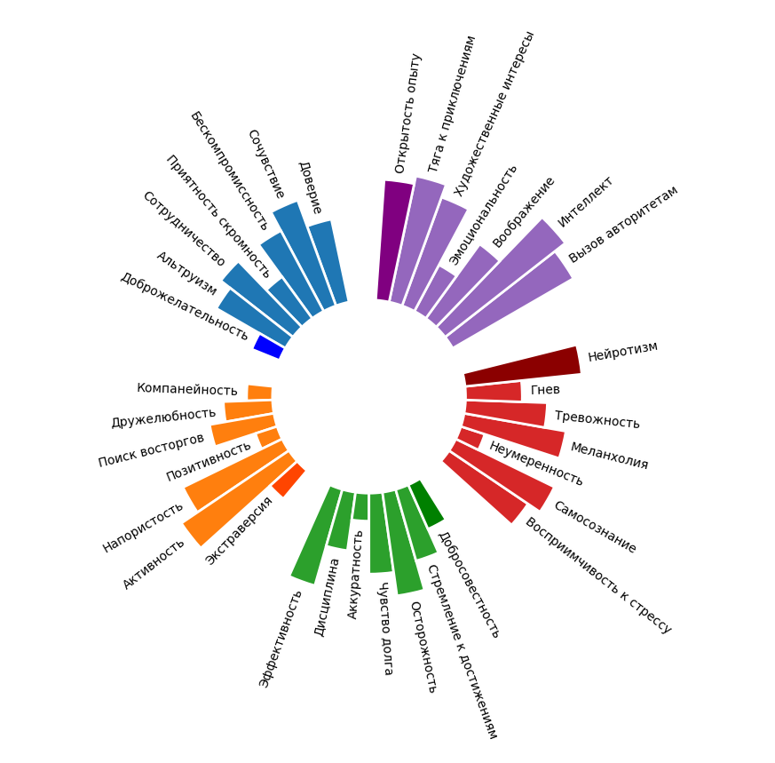
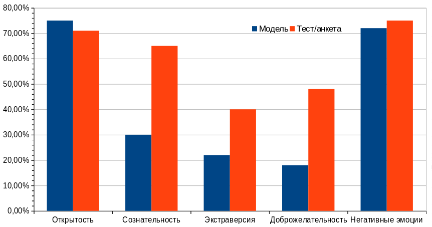
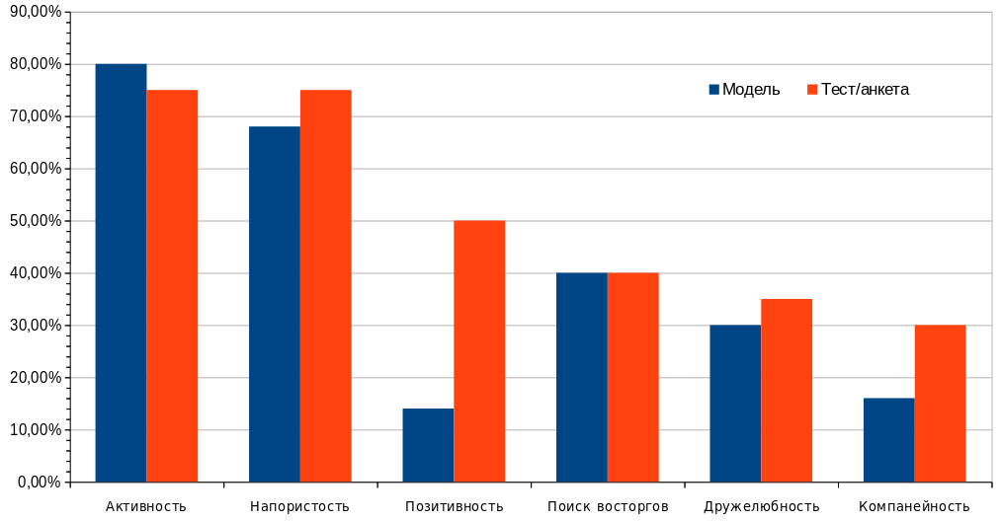
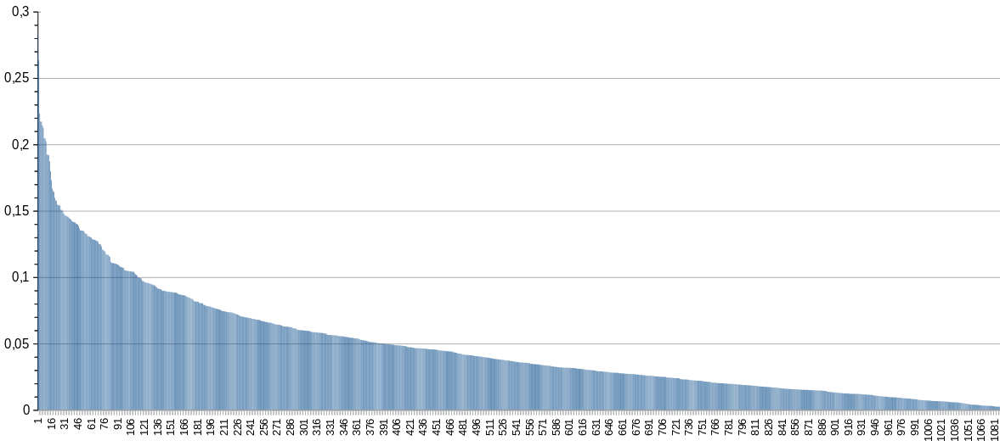
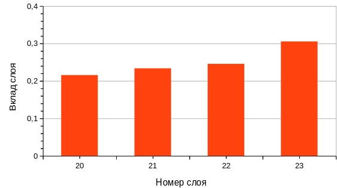

# Определение типа личности по тексту (на замену закрытому IBM Watson Personality Insights)

Некоторое время назад к нам обратился заказчик с не совсем обычной задачей — воспроизвести сервис IBM Watson Personality Insights, который анализировал текст, написанный человеком и определял по нему ряд личностных характеристик. Задача возникла по причине того, что бизнес заказчика основывался на этом сервисе, в то время как IBM объявила, что сервис вскоре станет недоступен. В этой статье расскажем, что делал этот сервис и чем закончилась задача воспроизведения его функционала.

## Введение. Как устроена эта статья

Сначала я расскажу, что делал Watson Personality Insights и зачем это было людям нужно. Потом будет описание данных, которые мы получили, структуры модели и основных результатов. Вторая часть написана несколько более сложным языком и рассчитана на специалистов, которые знают, что такое GRU, MLP, BERT, вектора слов и т. п. Если эти подробности вам не близки, то можно эту часть пропустить и прочитать только часть 1-ю и 3-ю части «Обсуждение результатов и анализ примеров», где результаты работы модели представлены более наглядно в интуитивно понятной форме.

Отмечу сразу, что работа описанная в статье была сделана почти два года назад, но соображения конфиденциальности позволили написать о ней только сейчас, поэтому методы и модели примененные в статье для решения задачи на сегодняшний день могли в ряде аспектов устареть. Кроме того, прошу простить, если сложится ощущение, что часть деталей упущена — некоторую информацию о проекте нельзя публиковать, например я не смогу объяснить чем занимался заказчик и зачем ему была нужна эта модель.

С этими оговорками, можем наконец перейти к делу.

## Что делал Watson Personality Insights

Основная идея данного сервиса состояла в том, что он получает на вход текст написанный определенным человеком и определяет по этому тексту четыре группы характеристик личности.

1. Шкалы «Большая пятёрка»
2. Потребности
3. Ценности
4. Покупательские предпочтения

«__Большая пятёрка__» это психологическая модель описания личности через 5 основных свойств. В отличие от многих популярных тестов, «большая пятёрка» имеет под собой научную основу (многие исследователи считают, что это единственная модель свойств личности, которая имеет научное обоснование).

История создания этой модели коротко такова. В начале XX века несколько исследователей, независимо друг от друга пытались изучать способы, которыми люди описывают характеристики других людей. Они брали описания вроде «этот человек злобный» или «всегда выполняет работу добросовестно» и выделяли из них описательные слова (злобный, добросовестно…). Эта идея берет свое начало в «лексической гипотезе» высказанной Френсисом Гальтоном еще в конце XIX века [1]. Ее суть в том, что любые аспекты человеческой личности так или иначе отражаются в языке и путем изучения языка можно делать выводы о структуре личности. В 40-х годах XX века Гордон Олпорт и Генри Одберт собрали 18000 таких слов и сгруппировали их в 4000 разных характеристик личности. Далее с появлением компьютера другие исследователи начали применять факторный анализ и сократили число сначала до 18, потом до 16, ну и так далее, пока в 70-х годах XX века две группы (группа Поля Косты из Национального Института Здоровья США и Льюиса Голберга из Мичиганского университета) независимо друг от друга не пришли к 5 главным факторам. На основании этих факторов был далее разработан опросник из 240 вопросов [2].

Пять основных факторов получили в итоге названия:

1. экстраверсия,
2. доброжелательность (дружелюбие, способность прийти к согласию),
3. добросовестность (сознательность),
4. нейротизм (эмоциональная нестабильность, негативные эмоции, эмоциональный диапазон)
5. открытость опыту

(в литературе встречаются разные варианты названий и их переводов, поэтому приведено несколько названий в скобках)

Внутри 5 главных факторов также можно выделить отдельные аспекты, до 7 штук на каждый основной фактор.

__Потребности__. Личные потребности описывают 12 измерений аспектов личности, которые могут резонировать с данным человеком: волнение, гармония, любопытство, идеал, близость, самовыражение, свобода, любовь, практичность, стабильность, вызов и структура. Потребности судя по всему продукт внутренних исследований IBM, по крайней мере ссылки на описание потребностей, которые мне удалось найти ведут только на страницы документации сервиса (которые сейчас более недоступны).

__Ценности__. Ценности, которые важны для человека и могут влиять на поведение при принятии решений помощь другим, традиции, удовольствие от жизни, достижения и открытость к изменениям. Эти ценности основаны на работе Шварца «Основные человеческие ценности: теория, измерение и приложения». [3], в которой автор с помощью опросов пытался найти ценности, встречающиеся во всех культурах. Шварц выделяет 10 различных ценностей, но Personality Insights умел определять пять: консерватизм/сохранение, открытость к изменениям, гедонизм, самосовершенствование, самопревосхождение (conservation, openness to change, hedonism, self-enhancement, self-transcendence)

Характеристики личности представляют собой числа от 0 до 1, причем это не значения шкал непосредственно, а персентили, т. е. 0.9 по шкале «доброжелательность» означает, что человек входит в 10% самых доброжелательных людей (среди популяции, на которой разрабатывался сервис, т. е. например для английского языка это англоговорящие люди).

__Потребительские предпочтения__. Судя по техническому отчету IBM [4] характеристики личности можно использовать для предсказания предпочтений в товарах/услугах, так как существует корреляция между свойствами личностью и тем, что человеку нравится/не нравится. Корреляция это статистическая, т. е. имея конкретного человека нельзя на 100% сказать, что вот он будет смотреть фильмы ужасов, или там покупать шоколадные батончики, но имея группу людей можно выделить аудиторию, которая с большей вероятностью будет склонна или не склонна покупать определенные группы товаров.

Watson непосредственно определял 41 параметр касающийся предпочтений человека, вроде «Ценит качество», «Любит фильмы ужасов», «Ценит безопасность продукта» и т. п. Их можно условно сгруппировать на общие («Ценит безопасность продукта», «Озабочен влиянием на экологию»), принцип выбора продуктов («По бренду», «Под влиянием соц. Сетей»), предпочтения в музыке, фильмах и книгах.

Данные параметры могут иметь только три фиксированных значения — 0, 0.5 или 1 где 0 означает отсутствие признака, 1 — присутствие, а 0.5, присутствие до определенной степени

### Применения и этические аспекты

Может показаться, что Personality Insights это исключительно вредный и общественно опасный продукт для вторжения в личную жизнь. Собственно, вероятно поэтому он и был закрыт. Поэтому возникает вопрос, насколько правильно публиковать статью о разработке подобного сервиса. Но нужно отметить два важных момента:

1. Существует довольно много общественно полезных применений такой модели. Например, Personality Insights использовался в психотерапии для оценки состояния пациентов [5], в искусстве (оценка личности персонажей пьес Шекспира) [6], определении спама [7] а также в научных исследованиях. Например, исследования установили связь между экологической политикой крупных компаний и личностными характеристиками их директоров [8], а также выявили оптимальные характеристики личности для команды разработчиков ПО [9,10]
2. Наивно полагать, что другие широко используемые модели, например показа таргетированной рекламы, рекомендации музыки и видео, ленты в соцсетях и.т.п. не имеют в каком-то виде репрезентации характеристик личности пользователя. Просто там данный аспект не выпячивается и соответственно не вызывает такой психологической реакции неприятия, но по сути происходит все то же самое.
3. Наконец, исчезновение Watson Personality Insights не привело к исчезновению доступности подобных сервисов — более мелкие компании продолжают их развивать, появляются системы определения личности по видео и т. п. В этом плане сокрытие информации об их устройстве и возможностях не кажется полезным, скорее наоборот, чем больше людей знают о том, что это такое, что может делать и в общих чертах как работает, тем лучше.

## Разработка модели

### Данные и метрики качества

Обучающую выборку для этой задачи предоставил заказчик. Где он ее взял достоверно неизвестно — возможно провел собственные исследования, а может быть просто собрал ответы сервиса. В любом случае мы получили таблицу, в которой был текст, написанный человеком и 94 параметра, в целом похожие на то, что выдавал Watson Personality Insights. Всего в таблице было 28000 записей обучающих данных и 2000 — тестовых.

У текстов в выборке оказалось достаточно неравномерное распределение по длине (рис 1).

*Рисунок 1. Распределение текстов по длине*

Распределение не симметричное, максимум приходится на тексты длиной около 1500 слов, но имеется длинный хвост и в итоге существенную долю выборки составляют тексты длиннее 6000 слов.

На сайте Personality Insights качество моделей Watson оценивалось с помощью двух показателей — средней абсолютной ошибки (MAE) и коэффициента корреляции. До того как прийти к нам, заказчик провел свои работы и получил MAE 0.14, соответственно, задача была поставлена получить существенное улучшение по сравнению с ним, и основной метрикой заказчик считал именно MAE.

Данные представляют собой смесь нескольких языков с одним доминирующим (90%) и тремя другими (4%, 3%, 3%). Соглашение с заказчиком не позволяет, к сожалению обозначить конкретные языки набора данных.

### Создание модели

В литературе для предсказания характеристик Big 5 использовались различные методы линейная регрессия с использованием признаков полученных латентным семантическим анализом [11], ридж-регрессия по большому набору собранных вручную признаков [12], SVM с признаками TF/IDF [13], word2vec и doc2vec [14]. В более современных работах присутствуют сверточные нейронные сети [15, 16], а также предобученные модели BERT [17]

Модель, которую построил заказчик использовала вектора слов word2vec и рекуррентную нейронную сеть на базе GRU (gated recurrent unit) (Рис 1а). Сначала все слова преобразовывались в вектора, потом к тексту применялось несколько слоев GRU и последнее состояние возникшее после «прочтения» нейросетью всего текста подавалось на вход слоя нейронов с сигмоидной функцией активации, выходы которого должны были предсказывать нужные значения. Обучалась модель с функцией ошибки MSE (среднеквадратичное отклонение).

#### Первый вариант модели

Посмотрев на модель заказчика, мы решили, что это не оптимальное решение и его должно быть легко улучшить достаточно простыми мерами. Во-первых, на практике использовать для анализа целого текста последнее состояние рекуррентной нейронной сети обычно плохая идея, так как оно будет отражать лишь концовку текста, установить связи с началом текста

*Рисунок 2. Архитектура моделей. А) Модель заказчика Б) Первый вариант нашей модели*

Для такой сети сложно, поэтому, если нужная информация есть только в начале, она легко переобучается используя случайные признаки из концовки. Сигмоидная функция активации обычно не очень хорошо подходит для задачи регрессии. В литературе для регрессии рекомендуют использовать линейную активацию или RelU. Наконец, как видно из краткого обзора литературы, системы использующие предобученные модели типа BERT дают лучший результат на этой задаче (ну и почти на любой другой задаче обработки текста). Для первого опыта была взята модель многоязычная версия BERT-base (uncased).

В этом тексте я не буду вдаваться в детали как работают предобученные языковые модели на базе трансформеров вроде модели BERT, так как на эту тему есть огромное число других статей. Скажу только, что это особый вид нейросети, который предварительно обучается на задаче определения нескольких пропущенных слов в тексте, состоят из нескольких слоев и в каждый слой формирует вектор кодирующий слово (фрагмент слова) и его контекст для каждого слова в тексте. Этот вектор можно взять и использовать в качестве признаков для решения различных задач.

В итоге для начала решили попробовать модель, показанную на рис 1 б. Суть ее очень проста — для каждого слова (точнее токена, так как BERT разбивает слова на части) берутся вектора BERT из определенного слоя, их значения усредняются по каждому измерению и подаются на вход полносвязной нейронной сети (функция активации Tanh), после чего следует слой с линейной активацией.

Важно отметить, что длина контекста BERT составляет 512 токенов, что для наших текстов составляет примерно 320-370 слов. Поэтому для начала мы просто обрезали все тексты до длины 350 слов, получили вектора для всех текстов, сохранили их в файл и далее с их использованием обучали полносвязную нейронную сеть предсказывать целевые значения (сразу все).

Может возникнуть вопрос, почему было сделано так много упрощений и допущений? Почему не дообучать BERT целиком, или не учесть как-то остальные слова? Дело в том, что мы обычно предпочитаем быстро собрать самый простой жизнеспособный вариант и посмотреть его в деле, чтобы потом его совершенствовать уже с учетом результатов. Как правило, такой подход быстрее позволяет получить понимание особенностей новой задачи и соответственно быстрее прийти к лучшему решению.

Получив результаты мы увидели две вещи: 1. Признаки из 12 слоя BERT похоже работают лучше остальных и 2. результаты серьезно хуже того, что у заказчика уже есть.

Увидев такие цифры можно было бы начать оптимизировать обучение модели, но факт того, что BERT даже в таком варианте работает настолько хуже GRU показался странным и мы запросили у заказчика подробности про его решение.

Как выяснилось не зря.

Заказчик поделил все тексты на фрагменты по 800 слов и каждый фрагмент сделал отдельным обучающим примером, при этом тестирование проводилось тоже на таких фрагментах. С одной стороны это привело к увеличению размера выборки, но с другой тут появляется много вопросов и потенциальных проблем. Например, в результате этого действия у нас появляется много примеров с точно совпадающими значениями, чего в реальных данных не будет. В идеале, если мы делаем такую операцию для увеличения выборки, то мы должны тестовые данные не трогать, иначе можно увидеть искаженную картину.

Когда мы скопировали точно метод получения фрагментов заказчика, получилось MAE 0.132, что несколько лучше, чем 0.14, но не сильно. После объяснения заказчику ситуации, тот согласился, что то, что сделано «не хорошо», но не согласился с идеей считать MAE на немодифицированной тестовой выборке, «мы понимаем суть проблемы, но нам бы хотелось пока сделать так как есть».

Поэтому работа шла в дальнейшем по оптимизации значения, полученного таким методом (Впрочем, мы потом проверили, и все испробованные методы, которые улучшают значения MAE на выборке из фрагментов, также дают лучшие результаты на исходной, неизменной выборке. Так что принципиально хуже качество от этого не становится).

#### Разделение на две модели

Далее мы решили обратить внимание на то, что у нас два сильно различных вида выходных данных — характеристики личности с непрерывным значением от 0 до 1 и потребительские предпочтения где возможно только три числа 1.0, 0.0 или 0.5. Вычислив MAE отдельно для характеристики личности и отдельно для потребительских предпочтений получили значения 0.11 и 0.148 соответственно, т. е. потребительские предпочтения сильно портят общую картину. Так как потребительские предпочтения можно рассматривать как задачу классификации на три класса, мы решили отказаться тут от регрессии и сделали модель, где было всего 123 выходных нейрона (41*3 нейрона для каждого класса) при этом три нейрона относящиеся к одному классу собраны в группу имеющую активацию softmax (получается, что в выходном слое есть как бы 41 классификатор по три класса в каждом). Благодаря этому MAE у потребительских предпочтений сразу упало до 0.129.

#### Увеличение контекста

Изначально у меня в голове почему-то засело представление о том, что тип личности определяется моделью за счет того, что она «цепляет» в тексте определенные словосочетания или слова, которые выдают личность владельца, некие детали. Когда мы обычно усредняем вектора слов, то чем больше векторов идет в усреднение, тем сильнее эти детали размываются, поэтому классификаторы, работа которых зависит от тонких деталей обычно хуже работают со входом в виде усредненного вектора (например, по усредненному вектору хорошо определять общую тематику текста, но не так хорошо тональность). Отсюда мне казалось, что в использовании только 350 первых слов большой беды нет, и если увеличивать контекст, то надо отказываться от усреднения, иначе пользы от этого не будет.

В действительности оказалось не так. Как видно из Таблицы 2, чем длиннее контекст, тем результат лучше.

#### Завершающие штрихи

Замена BERT на более современную модель XLM RoBERTa large позволило улучшить результаты (эта модель более ресурсозатратная и медленная, но заказчик сказал, что скорость работы не критична). Кроме того, использование признаков сразу из 4-х слоев вместо одного также дало улучшение результатов. Итоговый MAE составил 0.073 для характеристик личности и 0.098 для потребительских предпочтений.

## Анализ примеров

По итогам работ, нужные цифры были получены, но при этом у меня осталась некая неудовлетворенность в плане того, что вот мы получили какую-то цифру, но непонятно, что это на практике означает. Ну, то есть заказчик хотел определенных цифр и эти цифры получены, но действительно ли модель определяет что-то осмысленное относительно свойств личности? За счет чего это происходит? Насколько корректность определения сохраняется между различными языками?

Чтобы лучше понять, что происходит, я решил взять несколько конкретных примеров. Для начала, я собрал тексты своих сообщений в рабочем чате на русском в один текст из 600 слов и запустил модель на нем (в обучающих примерах, как я отмечал, не было русских текстов). Получились некоторые результаты (рис. 3)

*Рисунок 3. Пример графического отображения результатов свойств личности (Big 5)*

После этого, я перевел с помощью гугл тот же текст на 5 разных языков и повторил анализ. Получились немного разные цифры, но средний коэффициент корреляции по всем параметрам составил 0.68, что говорит о том, что характеристики, выдаваемые с разных переводов одного текста должны быть весьма похожи. Но возможно, все результаты всех текстов просто похожи между собой? Чтобы проверить это, я взял тексты другого человека и повторил данную операцию. Оказалось, что между переводами разных текстов корреляция составляет всего 0.43.

Само по себе это ничего особо не доказывает, так как взята для анализа слишком маленькая выборка, но ободряет, то что в целом модель ведет себя в соответствии со здравым смыслом, а не просто выдает случайные результаты как попало. Хотя проверки и рассмотрение вручную отдельных примеров не могут считаться за надежные данные, это все же помогает приобрести некоторое понимание и сформулировать гипотезы, которые в дальнейшем можно проверить более систематично.

Следующим действием я прошел онлайн тест Big 5 и получил там оценку. Сравнение основных показателей показало такую картину (рис. 4)

*Рисунок 4. Сравнение результатов модели и онлайн теста по основным шкалам Big5 на одном примере*

По рисунку кажется, что определенная связь между результатами теста и модели есть. Хотя конкретные значения отличаются, мы и не должны тут ожидать особой точности, потому что, как я писал, во-первых, обучающие данные могут представлять собой не очки Big 5, а персентили, а во-вторых по данным литературы хорошим результатом для моделей подобного рода является значение коэффициента корреляции 0.3-0.4. Ну и просто если пройти два разных теста Big5 (а есть вариации, предложенные разными исследователями, сокращения, разные переводы), цифры получаются несколько иные, хотя и похожие (в моем случае).

Можно также посмотреть на соответствие результатов по отдельным шкалам. Возьмем например шкалу экстраверсии (рис. 5).

*Рисунок 5. Сравнение результатов модели и онлайн теста по дополнительным шкалам шкалы «экстраверсия» Big5 на одном примере*

Снова чисто визуально кажется, что эти показатели имеют неплохое соответствие.

Каким же образом модель определяет тип личности? Было бы заманчиво предположить, что в ходе обучения больших языковых моделей типа BERT, в них образуется определенный нейрон, который, активируется, скажем, если текст написан человеком-экстравертом. В конце концов, характеристики личности человека, пишущего текст, являются важным фактором для предсказания слов в этом тексте и не исключено, что модель формирует некую репрезентацию этих характеристик. В действительности, однако, ситуация сложнее.

Чтобы выяснить относительную важность отдельных нейронов (точнее отдельных измерений в усредненном векторе, который мы берем как признаки), я обучил упрощенную модель, убрав слой MLP и оставив только слой линейной регрессии. Таким образом для каждого выходного нейрона, кодирующего определенную характеристику личности, был получен его вес в данной характеристики. После этого, я взял одну характеристику (открытость) и отсортировав веса по убыванию абсолютного значения, построил график (рис. 6)

*Рисунок 6. Абсолютные значения весов признаков 22 слоя Roberta large в линейной регрессии значения характеристики личности «открытость»*

Видно, что почти все нейроны вносят свой вклад, т. е. нет одного или 10 нейронов, которые отвечали бы только за характеристику открытости (примерно 85% вклада вносят самые важные 600 нейронов из 1024). Не изменяется принципиально картина и для других характеристик. Можно предположить, что заданное свойство личности влияет на целый комплекс разных свойств текста. Хотя надо отметить, что в репрезентациях XLM RoBERTa все же есть разряды среднее значение которых более существенно коррелирует с определенной характеристикой личности, поэтому оба утверждения могут оказаться верными — могут существовать одновременно нейроны «типа личности», скажем первые 10 на графике, и все остальные характеристики текста также могут быть отражать свойства личности в дополнение к этому.

Также, можно рассмотреть вклад каждого слоя целиком (рис. 7). Видно, что вклад верхних слоев больше, чем нижних. Надо сказать, что признаки, формируемые верхними слоями подобных моделей не всегда являются самыми лучшими, точнее даже сказать, как правило, не являются — в классических задачах, таких как поиск именованных сущностей или ответы на вопросы по тексту, признаки верхних уровней работают хуже, чем признаки промежуточных [18].

*Рисунок 7. Относительный вклад слоев модели XLM RoBERTa в определение характеристик личности*

Подводя итог, можно сказать, что анализ примеров не обнаружил ничего, что противоречило бы тому, что модель делает свою работу верно, даже если язык текста отличается от языка обучающих примеров, хотя тут, конечно, есть поле для более детальных исследований. Также интересным вопросом является изучение того, как различные свойства личности представлены в больших языковых моделях.
